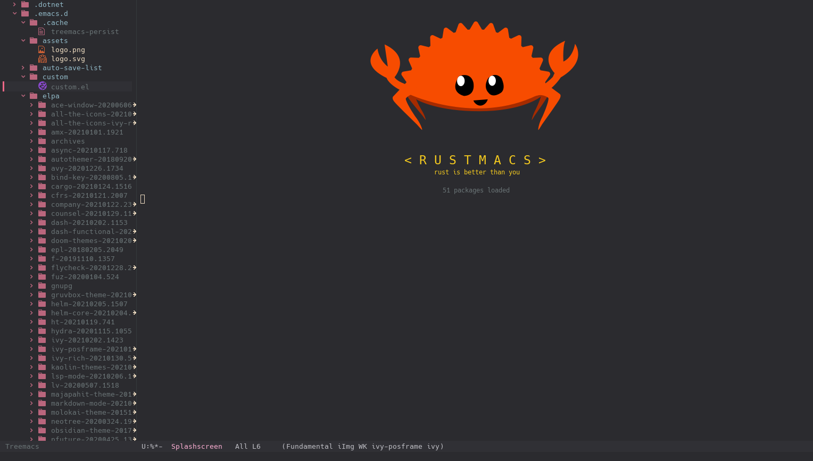
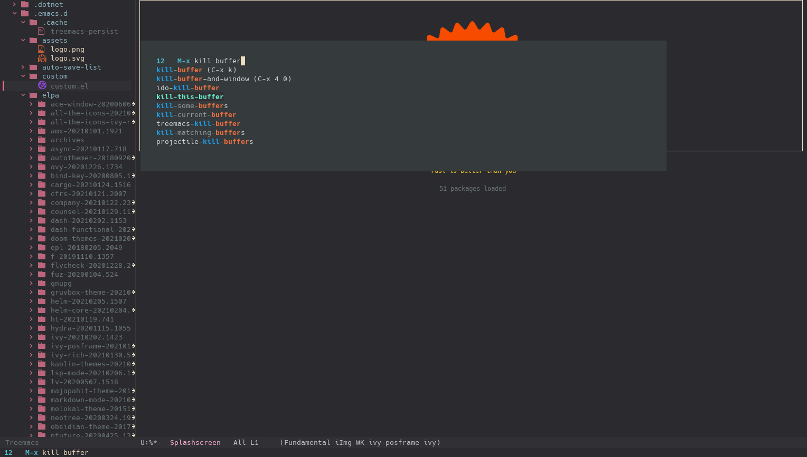

# Rustmacs

This is my personal [Emacs](https://www.gnu.org/software/emacs/) distribution. 

## Installation

just move this directory into your `.emacs.d` directory
```sh
git clone https://github.com/natrixaeria/rustmacs
mv -uT rustmacs ~/.emacs.d
```

## Screenshots

Startscreen | M-x
:-:|:-:
  |  

#TODO: *further steps?*

## A better name would be Frankenstein's monster

Much configuration is copied-pasted from other places.
Some of them are:
* [Ian's Emacs Configuration](https://github.com/ianpan870102/.personal-emacs.d)
* [Centaur Emacs](https://github.com/seagle0128/.emacs.d)
* [font-lock+](https://www.emacswiki.org/emacs/font-lock%2b.el)
